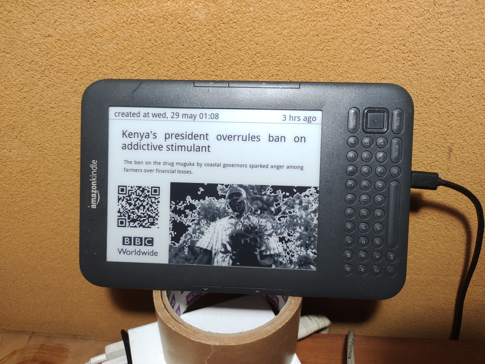

# Kindle bbc news feeds
 
This repo is for a bbc feeds display on old kindle 3.

## Screenshots

&nbsp;

<kbd></kbd>&nbsp;

## Requirements

- Jailbroken Kindle 3: https://wiki.mobileread.com/wiki/Kindle\_Hacks\_Information
- Server: Minimum 256M/100M OpenWrt router or SBC (e.g. OrangePi zero)
- Server OS: Openwrt, Ubuntu and Debian, etc which works with Python v3.11 or newer.
- Server's devices: USB port x1, LAN port x1


## Kindle PNG format

kindle requires special PNG format. Converting process is as follows:

```
                                               [The server sends a PNG file to Kindle and displays it]
 SVG image ------------> PNG image ----------> flattened PNG image --> Kindle Dispaly
           converter:              converter:
            Wand                    convert
            cairosvg
            qrcode
           
```

## Set up server

### 1. Install the program

Copy `(github)/server/opt/lib/kindle-bbc-news-feeds` to `(server)/opt/lib/kindle-bbc-news-feeds`.

### 2. Edit config files

#### a) user config

`config/user.xml`

- timezone: required
- lat & Lon (coordinate): optional

#### b) sheet layout

`config/sheet_layout###.xml`

- paper\_layout: `landscape` (fixed)
- encoding: `iso-8859-1` (fixed)
- font: (any font name in server, a full font path in Openwrt)
- img\_effect: From `0` to `9` (one of ineger)
- dark\_mode: `True`, `False`, `Auto` (if `timezone` in `config/user.xml` is `local`, `Auto` mode isn't effective)


#### c) sheet layout

`settings######.xml`

- Site setting
  - template: `bbc-news` (fixed)
  - category: String (one of valid category)
  - entries : Integer (entry number)
  - layout: Sheet layout file, e.g. `config/sheet_layout.xml`
  - logo_image: Image file location
  - breaking\_news\_only: Boolean (WIP)
- Kindle setting
  - duration: Integer, duration of each article
  - repeat: Integer, repeat number of entries
  - display\_reset: Boolean
  - post_run: String, When a program ends, the server runs the script.
  

### 4. Install programs, Python3 and it's modules.

#### Application requirements

- imageMagick
- cairo
- fontconfig

#### Python3(v3.11 or newer) and module requirements

- tzdata
- setuptools
- pip
- Wand
- Pillow
- qrcode
- feedparser
- cairosvg
- astral (optional)

e.g.) Openwrt

```
opkg update
opkg install python3 python3-ctypes python3-setuptools python3-pip
opkg install imagemagick
opkg install cairo
pip3 install tzdata 
pip3 install pillow
pip3 install feedparser 
pip3 install cairosvg
pip3 install qrcode
pip3 install Wand
pip3 install astral  # optional

```

#### Installation for Openwrt: To use Cairo on Openwrt.


1. Download SDK from Openwrt site.
2. Compile `cairo` with SDK and install the build package or use the pre-build package in this repository. (armv8 only)
3. Install `cairosvg` via pip.
4. Install a TTF font (e.g. `Sans_Regular.ttf` in this repository) to server's /root/.fonts: 
5. Run `fc-cache -f`


e.g.)

```
opkg install cairo_1.18.0-1_aarch64_generic.ipk
opkg install fontconfig
pip3 install cairosvg
```

### 5. Network Time Synchronization

To retrieve data correctly, setup NTP server.

### 6. Test run

All set up finished, then try it.

`./kindle-news-feeds.py png` # use default config

or one of config files:

`./kindle-news-feeds.py settings_######.xml png`

Take a look at `/tmp/KindleNewsStation_flatten.png`.


### 7. Install USB network

Connect a USB cable to both server and Kindle.&nbsp;
USB cable uses for network and power supply.&nbsp;
Install all relevant packages.&nbsp;

e.g.) Openwrt

```
opkg install kmod-usb-net kmod-usb-net-rndis kmod-usb-net-cdc-ether usbutils
```

## Set up Kindle

### 1. Set up usbnet

Server : 192.168.2.1/24

Kindle 3 : 192.168.2.2/24 (fixed address)

```
                LOCAL NETWORK               USB NETWORK			
                e.g.(192.168.1.0/24)
 WAN <-> ROUTER <--------------> THE SERVER <------> KINDLE
                                 192.168.2.1/24      192.168.2.2/24
		
```
When usbnet setup is finished, access to Kindle. (no password)

```
ssh root@192.168.2.2
```

### 2. Set up ssh Auth key

- Create server's pubkey.
- Set up server's ssh client environment.
- Copy server's ssh pubkey to Kindle.

e.g.) dropbear (OpenWrt)

```
cd /etc/dropbear
dropbearkey -y -f dropbear_rsa_host_key | grep "^ssh-rsa " > dropbear_rsa_host_key.pub
mkdir /root/.ssh
cd /root/.ssh
ln -s /etc/dropbear/dropbear_rsa_host_key id_dropbear
cd -
scp dropbear_rsa_host_key.pub root@192.168.2.2:/tmp
ssh root@192.168.2.2  # access to Kindle
cat /tmp/dropbear_rsa_host_key.pub >> /mnt/us/usbnet/etc/authorized_keys
exit
ssh root@192.168.2.2  # test passwordless login
```

e.g.) openssh (Openwrt)

```
cd /root/.ssh
opkg update
opkg install openssh-client openssh-keygen openssh-sftp-client
ssh-keygen -t ecdsa
scp id_ecdsa.pub root@192.168.2.2:/tmp
ssh root@192.168.2.2  # access to Kindle
cat /tmp/id_ecdsa.pub >> /mnt/us/usbnet/etc/authorized_keys
exit
ssh root@192.168.2.2  # test passwordless login
```

### 3. Test run

```
cd /opt/lib/kindle-bbc-news-feeds
./kindle-news-feeds.py [settings_#####.xml]
```

## Set up time schedule

Edit server's crontab and restart cron.


### Scenario 1

To display news feeds every hour.

e.g.) 

`crontab -e`

```
30 * * * * sh -c '/opt/lib/kindle-bbc-news-feeds/kindle-news-feeds.py 2>>/tmp/kindle-news-station.err'

```

```
/etc/init.d/cron stop
/etc/init.d/cron start
```

### Scenario 2 (WIP)

To display only breaking news feed.&nbsp;
Check out rss every 10 minutes.

`settings####.xml`

- breaking\_news\_only: True

`crontab -e`

```
5,15,25,35,45,55 * * * * sh -c '/opt/lib/kindle-bbc-news-feeds/kindle-news-feeds.py 2>>/tmp/kindle-news-station.err'

```

# Credits

- [bbc](https://www.bbc.com/news) ,British public service broadcaster.
- [Wand](https://docs.wand-py.org/), MagickWand API bindings for Python.